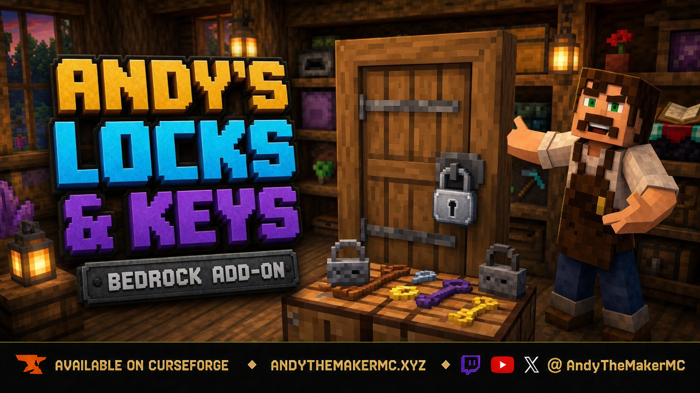
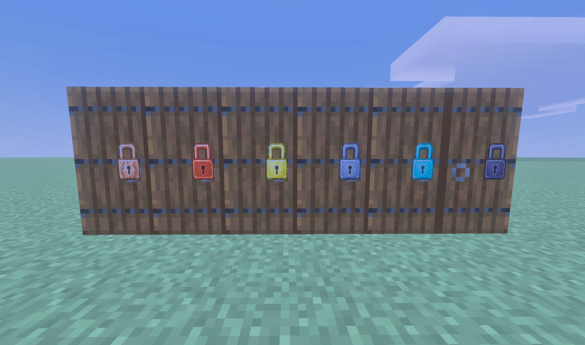
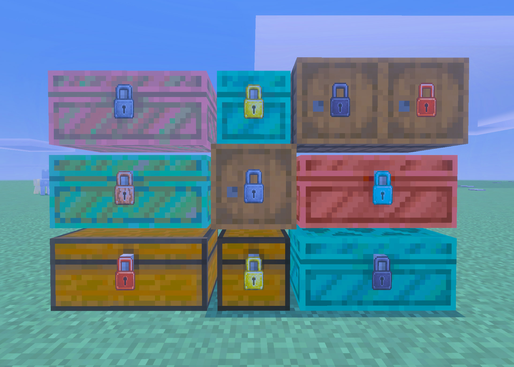
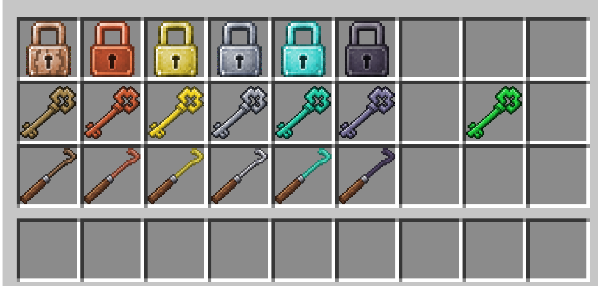
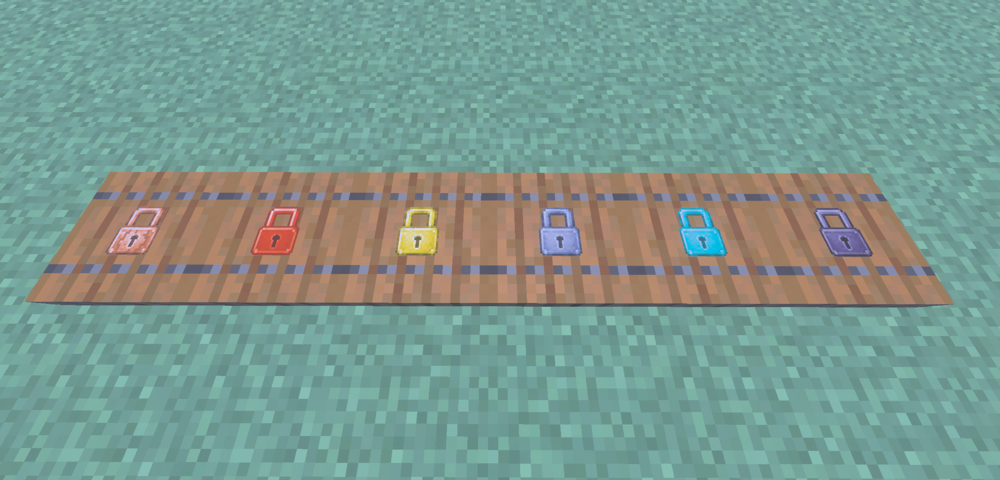
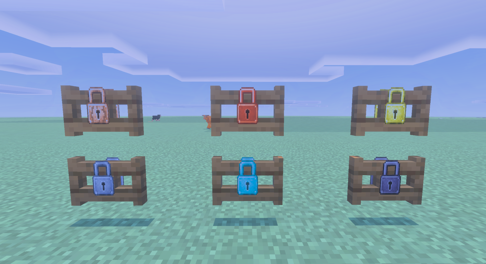
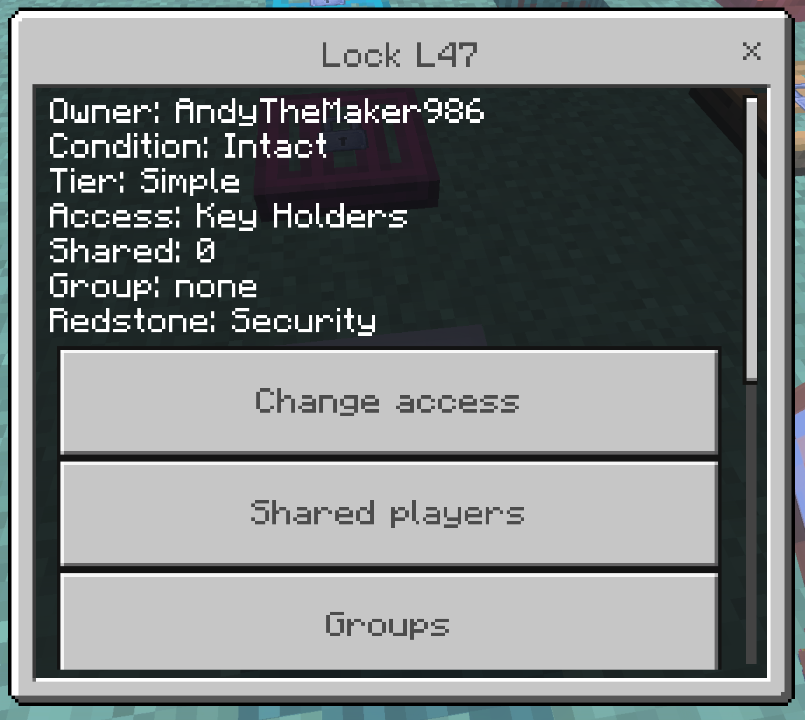
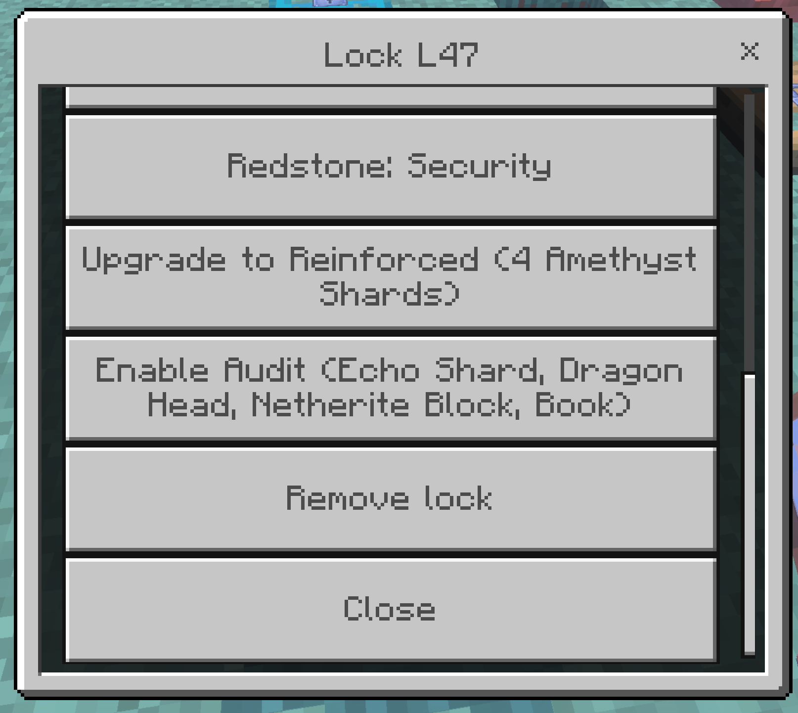

  

# Andy's Locks & Keys

**Lock vanilla doors, trapdoors, fence gates, chests, and barrels in Minecraft Bedrock.**

Andy's Locks & Keys lets you secure the entrances and containers you already build. Craft a lock, crouch, and use it on a door, trapdoor, fence gate, chest, or barrel. You become the owner. A visible padlock appears on the block. Other players cannot open it unless you share access, bind them a key, or they succeed at picking or smashing a Simple lock.

The add-on is built for Survival bases, shops, multiplayer towns, Realms, and servers. It uses only stable Script APIs. Cheats and experiments are not required. Standard graphics and Vibrant Visuals both work.

  

## Download

[Download Andy's Locks & Keys 0.11.3](Andys_Locks_And_Keys_0.11.3.mcaddon)  
**SHA-256:** `71A219FEEA39682C30F9221D2042E7AED5EC01361E213B64861A9FF4AA12325E`

Minecraft Bedrock **26.30 or newer** is required. Cheats, commands, and experimental gameplay toggles are not required.

When updating from an older test build, **break and replace existing locked doors, then lock them again** so hasps sit on the current leaf.

## 0.11.3 — Better Double Doors

Locks & Keys now has a secure interoperability channel for [Andy's Better Double Doors](https://github.com/CharlesJGantt/Andys-Better-Double-Doors). Authorized proximity opens still use the normal owner, key, sharing, group, public, and Redstone Allowed rules. No lock rule is bypassed. Better Double Doors is optional.

## Chests & Barrels Update

Locks are no longer limited to entrances. Secure normal Chests, Double Chests, Trapped Chests, Double Trapped Chests, Ender Chests, every Copper Chest oxidation and waxed variant, and Barrels using the same ownership, keys, sharing, groups, lockpicking, upgrades, repair, and brute-force systems used by doors.

  

- Locked Chests and Barrels cannot be opened by unauthorized players or destroyed with tools in Survival or Creative.
- Double Chests share one lock across both halves, with the padlock at the front seam.
- Single chests and Ender Chests show one compact padlock at the front latch.
- Barrels show one compact padlock only on the face you clicked when installing, including the top and bottom.
- Container padlocks are 20% smaller than entrance padlocks. Door, trapdoor, and fence-gate geometry is unchanged.
- Eligible Simple locks can be brute-forced only by a crouched Survival player holding a vanilla Netherite Pickaxe.
- Hold the mine button for the countdown, sounds, and particles. Release, stand up, look away, or switch items and the attempt resets.
- No other pickaxe or tool can start or advance brute force.
- A smashed lock stays attached and must be repaired. The container remains protected until you repair or remove it.
- Trapped Chests keep authorized redstone output. Denied interactions never open them.

Hoppers can still transfer items. The stable Bedrock Script API does not provide a cancellable hopper-transfer event.

Chest boats, chest minecarts, and shulker boxes are not supported.

## Features

- Lock any vanilla door, trapdoor, fence gate, normal/trapped/Ender chest, every Copper Chest variant, or barrel
- Wood through Netherite lock, key, and lockpick families
- Visible padlock hasp on the locked block
- Crouch-use a lock item to install; crouch-use again for settings
- Bound Keys for a specific Lock ID; Blank Keys for owner copying
- Master Key that opens every lock you own
- Operator holding a Master Key can open every lock in the world
- Access modes: Owner Only, Key Holders, Shared, Group, and Public
- Simple, Reinforced, and Advanced lock upgrades
- Lockpicking with material odds and pick durability
- Netherite pickaxe brute force on Simple locks (crouch, keep swinging, 30–50s)
- Locked blocks cannot be broken until the lock is removed
- Security redstone snap-close, or Redstone Allowed / Advanced wiring
- Double doors, paired fence gates, and double chests share one lock
- Overworld, Nether, and End
- Single-player, multiplayer, Realm, and supported Bedrock-server compatibility
- No required dependencies

  

## Screenshots

  

  

  

  

## Installation

### Windows, Android, iPhone, and iPad

1. Download `Andys_Locks_And_Keys_0.11.3.mcaddon` from this repository.
2. Open the downloaded file with Minecraft Bedrock.
3. Wait for Minecraft to confirm that both included packs imported successfully.
4. Create a world, or edit the world where you want to use the add-on.
5. Open **Behavior Packs → My Packs**.
6. Activate **Andy's Locks & Keys [BP]**.
7. Confirm that **Andy's Locks & Keys [RP]** is active under Resource Packs.
8. Enter the world, place a door, chest, or barrel, and crouch-use a lock item on it.

Back up an important world before installing or updating any add-on.

### Xbox, PlayStation, and Nintendo Switch

Consoles generally cannot import arbitrary local `.mcaddon` files directly. Import and activate the add-on on Windows or mobile, upload the prepared world to a Realm, and join that Realm from the console.

## Crafting

All recipes are **always unlocked** in the recipe book. You do not have to find the material first.

### Locks (shapeless)

| Result | Ingredients |
|---|---|
| Wooden Lock | Oak planks + iron nugget |
| Copper Lock | Copper ingot + iron nugget |
| Gold Lock | Gold ingot + iron nugget |
| Iron Lock | Iron ingot + iron nugget |
| Diamond Lock | Diamond + iron nugget |
| Netherite Lock | Netherite ingot + iron nugget |

### Blank keys (shapeless)

| Result | Ingredients |
|---|---|
| Wooden Blank Key | Oak planks + stick |
| Copper Blank Key | Copper ingot + stick |
| Gold Blank Key | Gold ingot + stick |
| Iron Blank Key | Iron ingot + stick |
| Diamond Blank Key | Diamond + stick |
| Netherite Blank Key | Netherite ingot + stick |

Bound keys have no recipe. Crouch-use a blank key on a lock you own.

### Lockpicks (shaped, vertical: two sticks over the material)

| Result | Ingredients |
|---|---|
| Wooden Lockpick | 2 sticks + oak planks |
| Copper Lockpick | 2 sticks + copper ingot |
| Gold Lockpick | 2 sticks + gold ingot |
| Iron Lockpick | 2 sticks + iron ingot |
| Diamond Lockpick | 2 sticks + diamond |
| Netherite Lockpick | 2 sticks + netherite ingot |

### Master Key (shapeless)

| Result | Ingredients |
|---|---|
| Master Key | Emerald + netherite ingot + gold ingot |

## How to Use

### Lock an entrance or container

1. Craft a lock (see [Crafting](#crafting)).
2. Place a vanilla door, trapdoor, fence gate, chest, trapped chest, Ender chest, Copper Chest, or barrel.
3. Hold the lock, **crouch**, and use it on the block.
4. A padlock appears. You are the owner. Standing click still opens it for you.

Side-by-side matching doors, fence gates, or a real double chest share one lock. Chest padlocks sit at the front latch or the double-chest seam. Barrel padlocks sit on the exact face you clicked.

### Settings and remove

Crouch-use a lock item on a lock you own to open settings (access, sharing, groups, public, upgrades, repair, remove). Removing the lock returns a stamped lock item.

  

### Keys

Crouch-use a blank key on a lock you own to bind it. Standing-click with that bound key opens that lock and spends one use. A wrong key fails and still wears. Only the owner can copy keys.

Crouch-use a Master Key on a lock you own. That one key opens all of your locks.

### Lockpicking and smash

Aim a lockpick at someone else's lock. Success opens an entrance once, or grants three seconds to open a container. The lock stays. Reinforced locks need Diamond or Netherite picks.

Crouch with a Netherite Pickaxe and keep swinging at a Simple lock for 30–50 seconds to smash it in place. Stop swinging and progress resets. The block still cannot be broken until the lock is removed.

  

  

### Redstone

Security mode (default) closes unauthorized opens. Advanced / Redstone Allowed lets wiring work on purpose. Trapped Chests only pulse when an authorized player opens them.

See the [project wiki](https://github.com/CharlesJGantt/Andys-Locks-And-Keys/wiki) for the complete player guide.

## Compatibility and Technical Notes

- Minecraft Bedrock 26.30 or newer
- Both included packs must remain active at the same version
- Standard graphics and Vibrant Visuals
- Single-player, multiplayer, Realms, and supported Bedrock servers
- No required dependencies
- No experimental gameplay toggles
- No commands or Cheats required

Security Mode cannot cancel redstone in the engine. A door may flash open for a tick before it closes. A lever left on can flicker.

Hoppers can still move items in and out of locked chests and barrels.

## Troubleshooting

### The padlock is missing or floating

- Confirm **Andy's Locks & Keys [RP]** is active and matches the Behavior Pack version.
- Remove older Locks & Keys packs, then re-import.
- If you updated from an older test build, break the door, place it again, and lock it fresh.

### I cannot lock the block

- Crouch. Standing click opens the door or container instead of locking.
- Aim at the door, trapdoor, gate, chest, or barrel itself.
- Hold a lock item in the selected hotbar slot.

### The door opens from a button

- Default Security mode snaps unauthorized opens closed after a moment.
- A constantly powered lever can flicker. Use a button, or set Redstone Allowed.

### Brute force does nothing

- Crouch in Survival. Hold a Netherite Pickaxe. Keep swinging.
- Only Simple locks smash this way. Unbreaking III on the lock blocks smash.
- Progress resets if you stop, stand up, look away, or switch items.

## Follow and Support Andy

Visit [AndyTheMakerMC.xyz](https://AndyTheMakerMC.xyz) for Andy's add-ons, world lore, tutorials, guides, videos, and other Minecraft content.

Follow **@AndyTheMakerMC** on:

- [YouTube](https://www.youtube.com/@AndyTheMakerMC)
- [Twitch](https://twitch.tv/AndyTheMakerMC)
- [X](https://x.com/AndyTheMakerMC)
- [TikTok](https://www.tiktok.com/@AndyTheMakerMC)
- [Instagram](https://www.instagram.com/AndyTheMakerMC)

Support future projects through [Ko-fi](https://ko-fi.com/andythemaker) or a [direct Stripe contribution](https://buy.stripe.com/4gM4gz0qu0xwgxw0IfcMM00).

## Player, Server, Realm, and Content Creator Permission

Players may use an official, unmodified release of Andy's Locks & Keys in personal worlds, multiplayer worlds, Realms, and servers. Normal delivery of the official, unmodified add-on to players joining an authorized world, Realm, or server is permitted.

Content creators may use, review, and showcase an official, unmodified release in worlds, multiplayer worlds, Realms, servers, videos, livestreams, screenshots, tutorials, reviews, showcases, articles, guides, social posts, and other original gameplay content, including monetized content.

Credit to **AndyTheMakerMC** and a link to the official project page are appreciated whenever practical.

These permissions do not allow anyone to offer the add-on file as a separate download or to modify, translate, adapt, decompile, disassemble, reverse engineer, extract, repackage, mirror, rehost, resell, sublicense, redistribute, or reuse any project content.

## All Rights Reserved License

**All Rights Reserved. Copyright © 2026 Andy / AndyTheMakerMC.**

Except for the limited player, server, Realm, and content-creator permissions above, no part of the add-on, documentation, branding, textures, models, or promotional artwork may be redistributed, reuploaded, rehosted, mirrored, resold, sublicensed, bundled, repackaged, modified and published, translated, adapted, decompiled, disassembled, reverse engineered, extracted, reused, or incorporated into another add-on, pack, application, website, download, or project without prior written permission from the copyright holder.

The promotional artwork is original AI-assisted concept artwork directed for this project. It is not an in-game screenshot.

Minecraft is a trademark of Microsoft Corporation. This project is not affiliated with, endorsed by, sponsored by, or associated with Microsoft or Mojang Studios.
